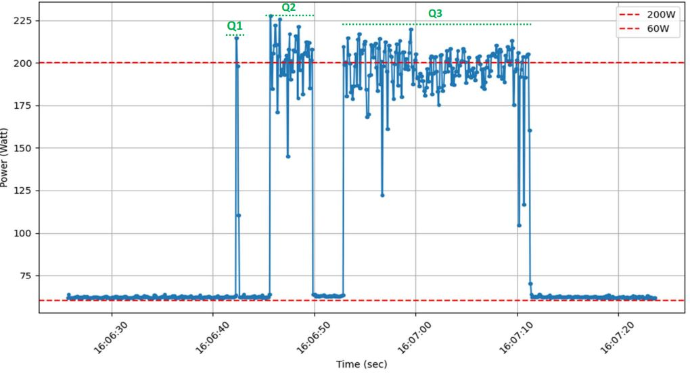

# Görünmeyen Yapay Zekâ Maliyeti: Bir Sorunun Gerçek Hayattaki Karşılığı Nedir?

Yapay zekâ alanındaki gelişmeler büyük bir heyecan yaratmaktadır.
Ancak bu sistemlerin enerji tüketimi konusunda farkındalık hâlâ sınırlıdır.
Bu çalışma, bir dil modeli ile gerçekleştirilen işlemlerin enerji tüketimini soru zorluklarına göre analiz ederek, yapay zekânın görünmeyen çevresel maliyetine ışık tutmayı amaçlamaktadır.

---
## 📑 İçindekiler

- 1. [🧠 Giriş: Kullanılan GPU Donanımı ve Dil Modeli](#-giriş-kullanılan-gpu-donanımı-ve-dil-modeli)
- 2. [📈 Ölçüm Yöntemi](#-ölçüm-yöntemi)  
   - 2.1 [⏱️ Soru Türüne Bağlı Hesaplama Süresinin Belirlenmesi](#-soru-türüne-bağlı-hesaplama-süresinin-belirlenmesi)
   - 2.2 [🔢 GPU Enerji Tüketiminin Hesaplanması](#-gpu-enerji-tüketiminin-hesaplanması)  
   - 2.3 [📊 Maliyet Tablosu](#-maliyet-tablosu)
- 3. [🔌 Gerçek Hayatla Karşılaştırmalar](#-gerçek-hayatla-karşılaştırmalar)
- 4. [📝 Sonuç ve Yorum](#-sonuç-ve-yorum)
- 5. [📚 Kaynaklar](#-kaynaklar)


---

## 🧠 Giriş: Kullanılan GPU Donanımı ve Dil Modeli

Bu çalışmada, Meta Research tarafından açık kaynak olarak sunulan LLaMA 4 Scout adlı dil modeli kullanılmıştır. Model, açık kaybak Ollama framework’ü aracılığıyla çalıştırılmış ve tüm testler NVIDIA A100 GPU üzerinde gerçekleştirilmiştir.

---

## 📈 Ölçüm Yöntemi

Ölçümler 100 milisaniye aralıklarla alınan güç tüketimi verilerine dayanarak yapılmıştır. Veriler 'nvidia-smi' komutu ile kaydedilmiş, daha sonra Python aracılığıyla analiz edilmiştir.

### ⏱️ Soru Türüne Bağlı Hesaplama Süresinin Belirlenmesi

Üç farklı zorluk düzeyinde soru belirlenmiş ve modelin cevaplama süresi ölçülmüştür. Her bir soru için model çağrılmadan önce ve sonra zaman damgaları alınarak işlem süresi hesaplanmıştır.

```python
from ollama import Client
from datetime import datetime

client = Client()

questions = {
    "Kolay": "What is the capital of France?",
    "Orta": "Can you briefly explain how a black hole is formed?",
    "Zor": "Please elaborate on the historical evolution of the concept of consciousness in philosophy."
}

def format_timestamp(dt):
    return dt.strftime("%Y/%m/%d %H:%M:%S.") + f"{int(dt.microsecond / 1000):03}"

for label, question in questions.items():
    print(f"
--- {label} SORU ---")
    
    start = datetime.now()
    print(f"Başlangıç: {format_timestamp(start)}")
    
    response = client.chat(model="llama4:scout", messages=[{"role": "user", "content": question}])
    
    end = datetime.now()
    print(f"Bitiş     : {format_timestamp(end)}")
    
    duration = (end - start).total_seconds()
    print(f"Süre      : {duration:.3f} saniye")
    
    print(f"Cevap     : {response['message']['content'][:300]}...
")
```

### 🔢 GPU Enerji Tüketiminin Hesaplanması

Enerji tüketimi şu temel formül ile hesaplanmıştır:
> **Enerji (Joule) = Güç (Watt) × Süre (saniye)**

Kullanılan komut:
```bash
nvidia-smi --query-gpu=timestamp,power.draw --format=csv -lms 100
```

Bu komut aşağıdaki Python kodu görselleştirilmiştir:

```python
import pandas as pd
import matplotlib.pyplot as plt

data = []
with open('power_log5.csv', 'r') as file:
    next(file)  # header
    for line in file:
        date, value = line.strip().split(',')
        value = float(value.replace('W', '').strip())
        data.append((date.strip(), value))

df = pd.DataFrame(data, columns=['Date', 'Value'])

df['Date'] = pd.to_datetime(df['Date'])

plt.figure(figsize=(10, 6))
plt.plot(df['Date'], df['Value'], marker='.')
plt.title('Enerji Tüketimi')
plt.xlabel('Time (sec)')
plt.ylabel('Power (Watt)')
plt.grid(True)

plt.axhline(y=200, color='red', linestyle='--', label='200W')
plt.axhline(y=60, color='red', linestyle='--', label='60W')
plt.xticks(rotation=45)
plt.legend()
plt.tight_layout()
plt.savefig('power_log.png')
plt.show()
```





---
### 📊 Maliyet Tablosu

| Soru Zorluğu | Ort. Süre (saniye) | Ort. Güç (Watt) | Enerji (Joule) |
|--------------|-------------------------|-------------|----------------|
| Kolay        | 0.35                    | 200         | 62             |
| Orta         | 3.95                    | 200         | 780            |
| Zor          | 18.9                   | 200          | 3620           |   
---

## 🔌 Gerçek Hayatla Karşılaştırmalar

Yukarıdaki enerji değerlerini daha somut hale getirmek için günlük cihazlarla kıyaslayalım:

- 💡 **Kolay soru (62 J)**: 10W’lık LED ampulü **6 saniye** çalıştırmakla eşdeğer
- 🌬️ **Orta soru (780 J)**: 1300W saç kurutma makinesini **0.6 saniye** çalıştırmakla eşdeğer
- 🧊 **Zor soru (3620 J)**: 100W buzdolabını **36 dakika** çalıştırmakla eşdeğer

---
## 📝 Sonuç ve Yorum
Bu çalışma, dil modeli tabanlı yapay zekâ sistemlerinin görünmeyen ancak önemli bir boyutu olan enerji tüketimi konusuna dikkat çekmektedir.

Görünüşte sadece bir "soru sormak", arka planda yüksek performanslı donanımların çalışmasını ve önemli miktarda enerji harcanmasını gerektirebilir. Bu farkındalık, yapay zekâ sistemlerinin sürdürülebilir şekilde geliştirilmesi açısından kritiktir.

📌 Bir sonraki çalışmamda, çok daha yüksek işlem gücü gerektiren görsel modellerin enerji tüketimlerini karşılaştırmayı hedefliyorum.

## 📚 Kaynaklar
- https://huggingface.co/spaces/AIEnergyScore/Leaderboard
- https://ai.meta.com/blog/llama-4-multimodal-intelligence
- https://ollama.com/
- https://www.nvidia.com/en-us/data-center/a100/
